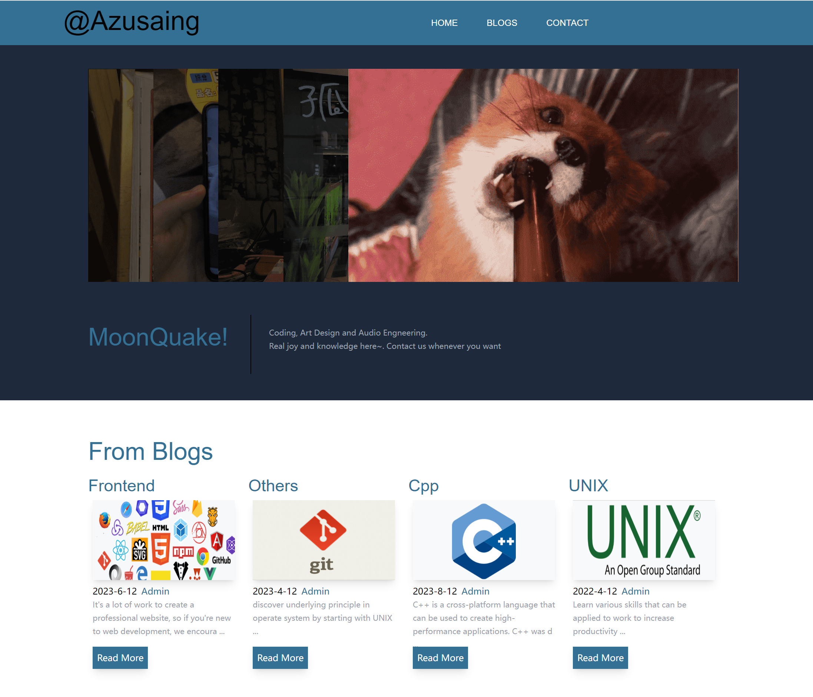

# MyBlog
Come and Visit mty website! http://azusaing.top

## Frontend
- **React**, **tailwindcss**, **typescript**

## Backend

**developed with:** 
- **gcc**, standard **UNIX** libraries and **C++11** features
- 3rd-parities: **jsoncpp**, **fmt**

## To Sum Up
- It's really troublesome and sticky to develop backend web application with **C++**, since there are almost no web frameworks for it. But as the meaning of this demo is for better understanding the basic principle of net programming, this demo is a good reference for me.
- This server uses the **Reactor** network IO model and utilizes the **epoll** APIs supported by **Linux** kernel from version **2.6**.  
- Also, I've designed a simple **HTTP** message handling class and a logger whose color could be customized by its initializor.

